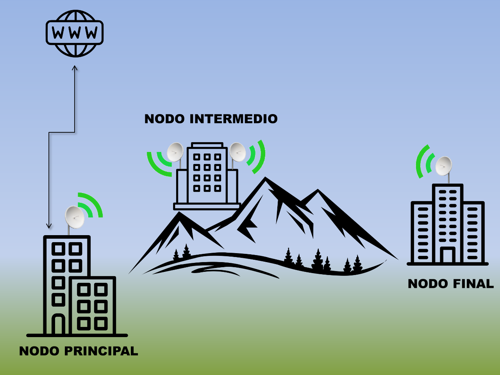

# 📡 Industrial Wireless Network Deployment (WiMAX / 5GHz Point-to-Point)

Design, implementation, and configuration of an industrial-grade high-throughput 5GHz wireless backhaul network. The project interconnects physical security systems (CCTV, access control) across three remote industrial facilities spanning approximately 1 km, successfully overcoming natural terrain obstacles (lack of direct Line of Sight).

---

## 📸 Network Topology Architecture

---

## 🎯 Project Overview & Problem Statement

In industrial security installations, interconnecting video surveillance (CCTV) and perimeter alarm systems across geographically separated sites often presents significant challenges:

- **Lack of Direct Line of Sight (LoS):** Natural terrain obstructions (hills/mountains) between the main headend and the final destination prevented a direct point-to-point (PtP) link.
- **High Bandwidth Requirements:** CCTV video streams require reliable, high-throughput, low-latency transmission.
- **Physical Constraints:** Trenching fiber optic cables across 1 km of rugged/industrial terrain was cost-prohibitive and logistically unfeasible.

---

## 🛠️ Network Architecture & Implementation

To resolve the Line-of-Sight constraint, a multi-hop wireless backbone was engineered using 4 EnGenius 5GHz directional outdoor antennas configured in a repeater/relay configuration:

1. **Main Node (Nodo Principal):**
   - Connects directly to the primary WAN/Internet gateway and central security management servers.
   - Features a high-gain 5GHz directional antenna aligned toward the intermediate relay site.
2. **Intermediate Relay Node (Nodo Intermedio):**
   - Strategically elevated on an intermediate facility to bypass mountain/terrain obstructions.
   - Operates a dual-antenna relay configuration (back-to-back PtP bridges) receiving the signal from the Main Node and re-transmitting it toward the Final Node.
3. **Final Node (Nodo Final):**
   - Terminal endpoint servicing field CCTV cameras and security controllers.
   - Aligned directly with the Intermediate Relay Node.

---

## 📋 Core Technical Competencies & Skills

- **Wireless Networking:** 5GHz PtP/PtMP Link Design, WiMAX/WLAN Protocols, RF Alignment, Channel Selection.
- **Hardware Deployment:** EnGenius Outdoor Wireless Bridges & Directional Antennas.
- **Structured Cabling:** Industrial Weatherproof Ethernet (Cat6 FTP/SFTP), Power over Ethernet (PoE) deployment.
- **Physical Security Integration:** IP CCTV Video Stream Transport, Network Segmentation, Low-Latency Security Links.

---
